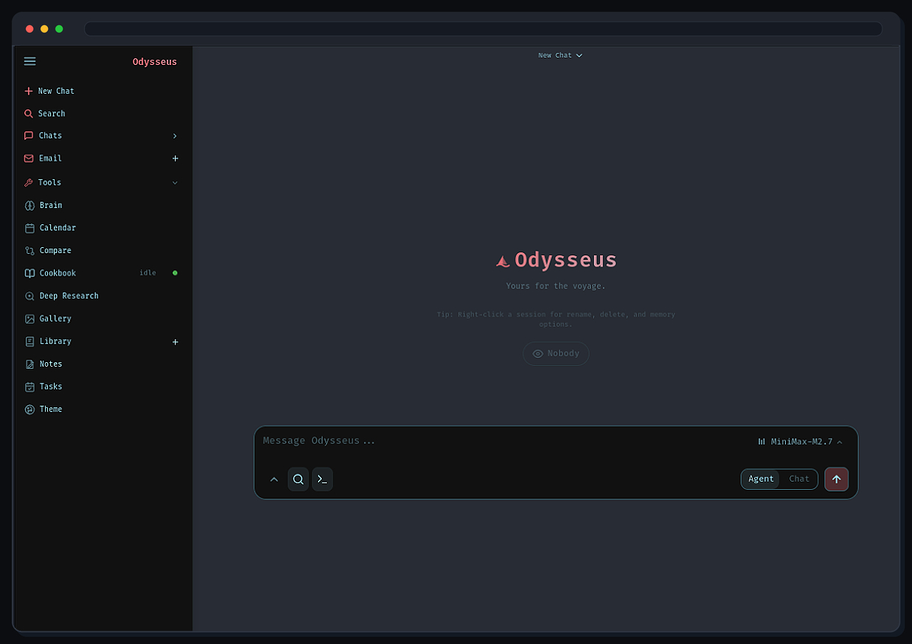

<h1 align="center">Pandamonium</h1>

<p align="center">
  <strong>Your self-hosted AI control plane.</strong><br>
  Local and API models, agents, voice, memory, tools, documents, and extensions in one workspace.
</p>

<p align="center"><sub>Maintained by MADPANDA3D.</sub></p>

<p align="center">
  <a href="#quick-start">Quick Start</a> ·
  <a href="docs/setup.md">Setup Guide</a> ·
  <a href="docs/voice-orb/README.md">Voice Orb</a> ·
  <a href="CONTRIBUTING.md">Contributing</a> ·
  <a href="ROADMAP.md">Roadmap</a>
</p>

<p align="center">
  
</p>

## Quick Start

```bash
git clone https://github.com/MADPANDA3D/Pandamonium.git
cd Pandamonium
cp .env.example .env
docker compose up -d --build
```

Open `http://localhost:7000` after the containers become healthy. The first
admin password is printed by:

```bash
docker compose logs pandamonium
```

Native Linux, macOS, Windows, GPU, HTTPS, and configuration instructions are
in the [setup guide](docs/setup.md).

## What Is Included

- **Chat and agents** — local or API models, tool use, MCP, files, shell, skills, and memory.
- **Voice Orb** — interruptible voice, setup diagnostics, camera/media controls, and optional read-only workers.
- **Extensions** — bounded Git installation, capability registration, lifecycle controls, and rollback.
- **Cookbook** — hardware-aware model recommendations, downloads, and serving.
- **Workspaces** — documents, email, notes, tasks, calendar, gallery, research, and model comparison.
- **Operations** — owner-scoped data, authentication, backups, security gates, and Docker/systemd installs.

## Command Line

The canonical command is `pandamonium`:

```bash
./scripts/pandamonium help
./scripts/pandamonium backup snapshot
./scripts/pandamonium mcp list
```

The former `odysseus` command names remain as compatibility aliases for
existing installations. New configuration uses `PANDAMONIUM_*` environment
variables; the former `ODYSSEUS_*` names remain accepted during migration.

## Security

Pandamonium exposes powerful local tools. Keep authentication enabled, keep
private data and credentials out of Git, and do not expose raw model or service
ports publicly. See [SECURITY.md](SECURITY.md) and the
[deployment guidance](docs/setup.md#security-notes).

## Project Lineage

Pandamonium began as a fork of
[Odysseus](https://github.com/pewdiepie-archdaemon/odysseus) and retains the
original project history, contributor attribution, and AGPL license. It is an
independent MADPANDA3D project, not an official Odysseus release. Details are
recorded in [NOTICE](NOTICE) and [ACKNOWLEDGMENTS.md](ACKNOWLEDGMENTS.md).

<p>
  <a href="https://github.com/pewdiepie-archdaemon/odysseus"></a>
</p>

## License

AGPL-3.0-or-later — see [LICENSE](LICENSE), [NOTICE](NOTICE), and
[ACKNOWLEDGMENTS.md](ACKNOWLEDGMENTS.md).
