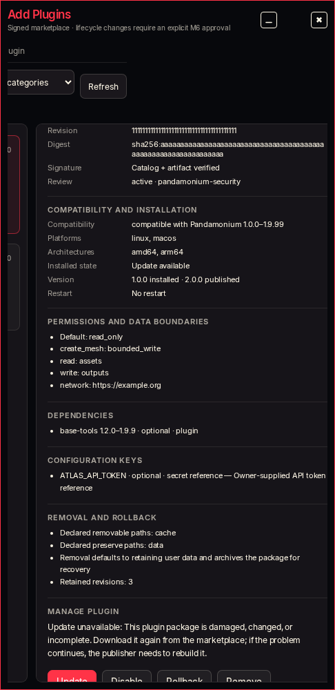
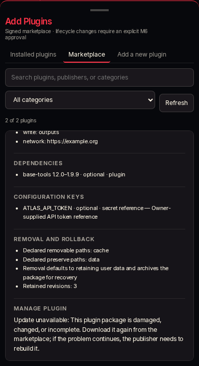

# MAD-957 package validation

Implementation: `71e83a7040f31123797671562b1d75b808a82cbe` on
`codex/mad-957-integration-artifacts`, based on v1.0.67 / `c890c857`.

## Verified locally, 2026-09-15

- Full Python suite: **6,419 passed, 5 skipped** (223 seconds). The final focused
  run also includes two later decompression/member-boundary checks.
- Package, publisher, installer, native skills, MCP and catalog tests:
  **65 passed**. Generated files and executable mode survive packaging;
  same-source package upgrades remain distinct; rollback and a recreated manager's
  enable restore the original package. Staging mutation fails before admission.
- Marketplace browser regression suite: **9 passed**. Error-copy captures:
  **2 passed**, desktop and mobile, using a rejected-package API fixture.
- `git diff --check`, Python compileall and JavaScript syntax checks passed.
- A disposable **running full app** passed authenticated HTTP catalog discovery,
  install preview, native authority approval, execution, Plugins listing, native
  agent Skills index, disable, enable and remove. The archive was built and
  signed from a prepared skill tree. Git acquisition was replaced with an
  assertion failure. Only artifact transport used an injected local fixture;
  this does not claim public artifact hosting or clean-install catalog bootstrap.
  Process, owner, signing key, packages and data were cleaned up.

The local app smoke was run with `.venv/bin/python
/tmp/pandamonium-mad957-live-smoke.py`; its temporary directory was separate from
Leo's account. Repeatable package/transport-boundary checks are in
`tests/test_marketplace_catalog_publish.py`, `tests/test_marketplace_catalog.py`
and `tests/test_extension_package.py`.

## Error presentation

Only the error-family text changes in this slice. Existing layout/theme controls
are reused. These captures show the existing marketplace displaying an actionable
package rejection. The purpose-first UI rebuild remains MAD-961; this is not its
acceptance evidence.

## Remaining program

Source-only foundation; no app release, deployment, public package publication or
personal-account corpus installation was performed here. Follow the
[approved program and 30-entry inventory](repository-plugin-ingestion-plan.md)
through MAD-958–MAD-965. Runtime-created files and credentials must stay outside
the immutable package tree. The file-name checks in prepared publication do not
replace the release secret scan.
