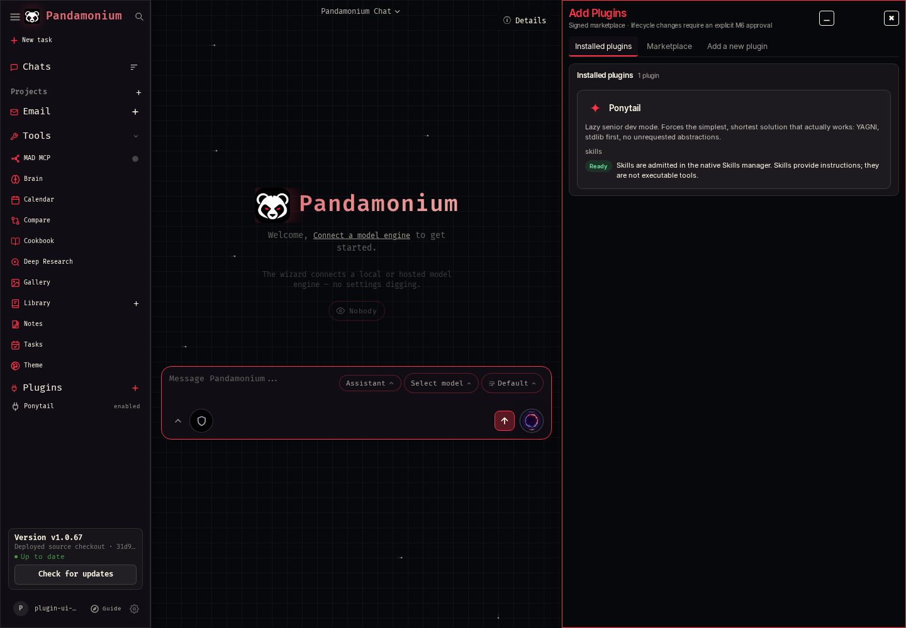
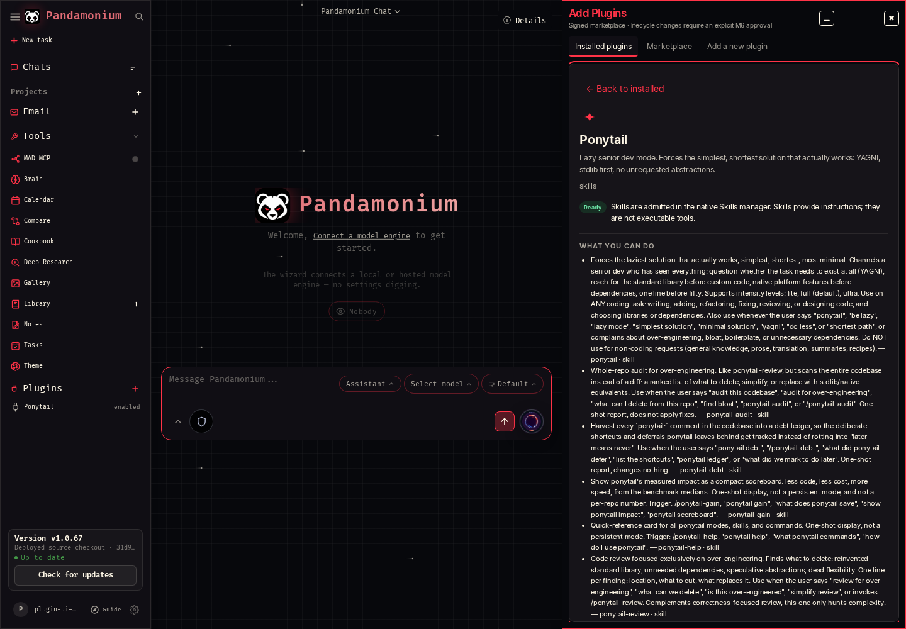
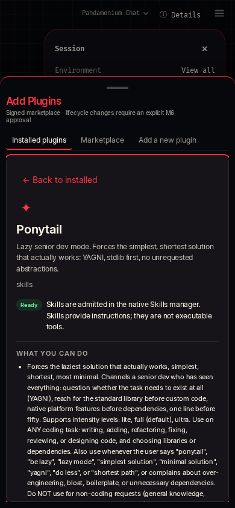

# MAD-961 — Plugin purpose and readiness

## Behavior

Optional, bounded manifest `metadata` carries the package summary, categories,
text icon, example requests, prerequisites and native skill descriptions.
The shared projection supplies scan results, installed rows/detail, signed
marketplace detail and native agent discovery. Existing manifests and signed
catalogs remain accepted. Repository classification, permission boundaries,
source revision, configuration keys and diagnostics remain in native expandable
details. Product descriptions are package content, never execution evidence.

Cards open a dedicated detail view with capabilities, examples, editable setup
and lifecycle actions. Keyboard activation, focus return, roving tabs and mobile
scrolling use existing controls; browsing never mounts capability schemas.

Readiness uses local lifecycle and execution evidence:

- **Preparing:** an owned lifecycle operation or serialized package call is active.
- **Needs setup:** the package has no current validated runtime/configuration,
  lacks native admission, or needs a live connection check.
- **Ready:** the shared CLI call checks accept the package digest, installing
  owner, configuration receipt, resource prerequisites and managed service scope;
  native skill bundles instead show admitted Skills with an explicit instruction-only
  explanation. These checks do not execute another package operation while browsing.
- **Failed:** the latest owned lifecycle operation failed for a disabled plugin.
- **Disabled:** the plugin needs enabling before use. Saving configuration retains
  the existing disable/revalidation behavior; pending approvals become stale.

An enabled registry row alone never establishes executable readiness. Configured
web/MCP surfaces remain Needs setup until their native connection workflow checks
live capabilities. A failed upgrade that preserves a working old revision can
still show Ready for that installed revision. Transient external endpoint health
is checked by actual calls; browsing does not probe third-party services.

## Verification

The runnable authenticated browser smoke is:

```sh
PLUGIN_UI_PROOF_DIR=/tmp/plugin-ui-proof node tests/deployed/plugin-purpose.mjs
```

It starts the actual app with a fresh disposable database, owner and extension
root, then scans the real Ponytail URL, installs through native approval, verifies
six admitted Skills, checks package-copy parity, keyboard detail/focus return,
mobile overflow, marketplace detail and disable/enable/remove. It verifies zero
remaining installed plugins, stops its child server and deletes disposable data.
The source resolved to `e3ba2aa6f1e6f0bc4d69eb09c9f0d0a93af56156`.
See the [sanitized receipt](mad-961-plugin-ui.json).







Focused Python regressions cover metadata parity and validation, actual lifecycle
state reads, stale/tampered/wrong-owner runtime evidence, managed service readiness
and lazy agent mounting. Browser regressions cover editable setup and accessible
flow at 1280 and 390 pixels. The authenticated smoke uses the real native skill
adapter; it does not claim live-model semantic accuracy or GPU inference.

Final local checks: **6,467 Python passed / 5 skipped**, **185 Chromium passed**;
after the one-line installed-card height fix, **5 focused Chromium passed** and
the authenticated smoke passed again. Scoped Ruff, isort (Black profile), mypy
(four shared modules), Python compilation, Node syntax and diff hygiene passed.
The two-line owner forwarding in legacy `admin_tools.py` adds no lint findings:
its 52 existing findings exactly match the predecessor.

## Publication and rollback

This is source work only. Signed catalog bootstrap is MAD-962; broader corpus and
release/deployed acceptance remain later M17 issues. No personal-account plugin
install, catalog publication, release or CT103 deployment is part of this proof.
No production dependency, database migration or environment setting was added.
Revert the scoped source change to restore the previous UI; retain installed
packages, owner configuration and runtime data. Existing clients may ignore the
optional metadata; older servers that strictly reject unknown manifest fields
must be upgraded before installing newly generated metadata-bearing packages.
