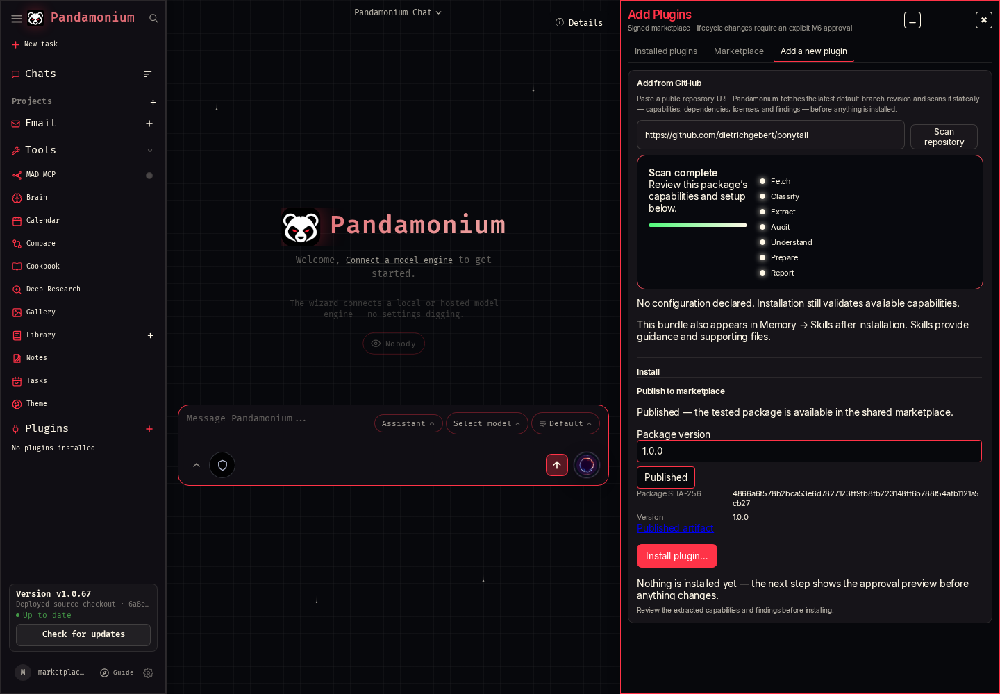
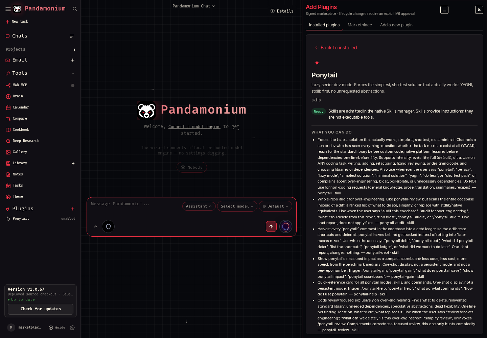
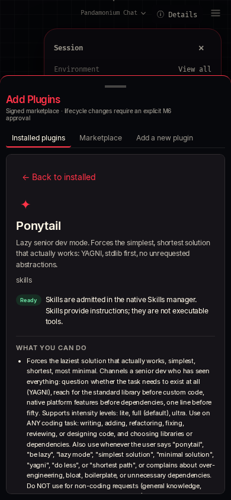

# MAD-962 — Developer publication and marketplace bootstrap

The developer's **Add to marketplace** action now finishes the existing M17
package flow: finalize version/provenance, validate in disposable state, sign,
upload immutable bytes, atomically publish the catalog, and read it back before
showing Published. It works from a completed URL scan without installing into the
developer account, and from an owned installed package. The old submission route
forwards to publication instead of leaving an unsigned review file.

The shared channel is the dedicated `marketplace` branch in
[MADPANDA3D/Pandamonium](https://github.com/MADPANDA3D/Pandamonium/tree/marketplace/marketplace).
The app bundles the signed catalog and a pinned public trust key. Refresh is
bounded and atomic; invalid/untrusted/stale refreshes retain the last valid cache
until its expiry. Existing manually configured trust stores remain explicit local
channels. See the [runbook](marketplace-publishing-runbook.md).

## Actual browser and GitHub proof

Run from the source checkout with developer publisher credentials configured:

```sh
PANDAMONIUM_MARKETPLACE_SIGNING_KEY_FILE=/secure/publisher/marketplace-signing.pem \
  node tests/deployed/marketplace-publication.mjs
```

This runner creates two separate authenticated app/data directories. It scans real
Ponytail, publishes directly from the scan, verifies zero installed producer
plugins, and starts a fresh consumer with no publisher signing-key configuration.
The consumer discovers the signed catalog, approves the actual marketplace
install, checks the installed package digest and six native Skills, then removes
the plugin. Both apps/processes/data are cleaned up. The runner overrides only the
marketplace compatibility version to **1.0.68**, the declared next-release floor;
MAD-965 owns the real release bump. The updater still displays source version
1.0.67 in these screenshots. This is source-app proof, not a CT103 deployment.

[Sanitized receipt](mad-962-publication.json):

- Source: `dietrichgebert/ponytail@e3ba2aa6f1e6f0bc4d69eb09c9f0d0a93af56156`.
- Draft input digest: `5f61d19d005bf02f81eb07d02250913377b01c8232ee1f947452ea3de63e4b3e`.
- Final tested/published/installed digest:
  `4866a6f578b2bca53e6d7827123ff9fb8fb223148ff6b788f54afb1121a5cb27`.
- Final package version: **1.0.0**; draft version and `self` provenance were
  finalized before validation. Integration code/references remain preserved.
- [Immutable package release](https://github.com/MADPANDA3D/Pandamonium/releases/tag/plugin-ponytail-1.0.0-4866a6f578b2bca53e6d7827123ff9fb8fb223148ff6b788f54afb1121a5cb27).
- Repeated actual developer publication reuses the same release bytes/catalog
  entry. An initial empty draft from the failed draft-lookup experiment was
  identified by exact release ID and removed; no abandoned submission remains.
- Publisher account installs: **0**. Consumer native Skills: **6**. Remaining
  consumer plugins: **0**. No Leo account data or existing plugins were touched.







## Recovery and security proof

[Live rollback receipt](mad-962-catalog-rollback.json): the signed catalog was
atomically restored to its empty bootstrap snapshot, read back, then restored to
the published entry with a new signature/timestamp. Rollback commit
`133d4a55da9277132110be2f1997ec33362584bd`; final restoration
`04ce3250be846b4d53b4e0d7b316f9cf0fb97815`. Artifact bytes were unchanged, and the
bundled snapshot matches the restored catalog.

`tests/test_marketplace_publication.py` covers actual native admission,
version/provenance finalization, upload failure/retry, same-version conflict,
concurrent catalog-entry preservation, rollback conflict refusal, pinned trust,
tampered cache, job restart/single-flight and owner isolation. A real generated CLI
check verifies that publisher credentials/environment and its private key file
are inaccessible in the sandbox and that validation runtime files are cleaned up.

Local full verification: **6,474 Python passed / 5 skipped**, **185 Chromium
passed**. Final additional regressions and preflight changes: **45 focused Python
passed**, **10 focused Chromium passed**, and the actual authenticated two-app
smoke passed again. Scoped Ruff, isort Black profile, mypy on both new shared
modules, Python/Node syntax and diff hygiene passed. Full Python checks require
`sh scripts/check_package_runtimes.sh .venv/bin/python -m pytest -q`; a direct
pytest invocation correctly failed seven existing resource-admission tests when
no bounded runtime filesystem was configured. No security gate was relaxed.

Review follow-up: publication job identity includes the requested version, so a
different version cannot accidentally poll an active job for earlier parameters.
Only GitHub HTTP 409 triggers catalog compare-and-swap retries; access/auth/server
failures retain their sanitized error, including during rollback. The expanded
publication/catalog/installer regression selection passed **35 tests**; scoped
Ruff, isort and mypy passed again.

## Boundaries and rollback

No application release or CT103 deployment occurred. The one plugin artifact and
shared catalog are public. Corpus validation/publication remains MAD-963,
held-out recovery remains MAD-964, and release/provisioning/operator acceptance
remains MAD-965. The publisher requires a configured trusted host with gh and the
mode-600 signing key. Unsupported native remote/live-only packages fail with
instructions to prepare an isolated adapter with operation checks; schemas alone
are not accepted as execution proof. Native Skills proof does not claim model
semantic accuracy. No new production dependency or database schema was added.

A source revert restores the prior UI/backend while retaining installed packages,
owner configuration and runtime data. Catalog rollback uses signed snapshots and
compare-and-swap; it never deletes immutable releases or alters installed copies.
