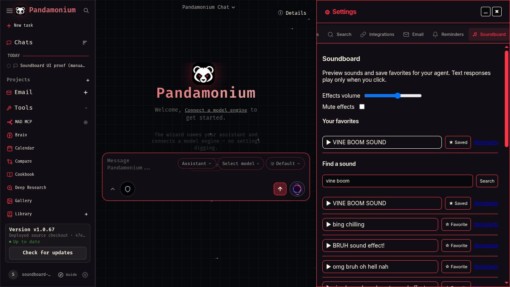
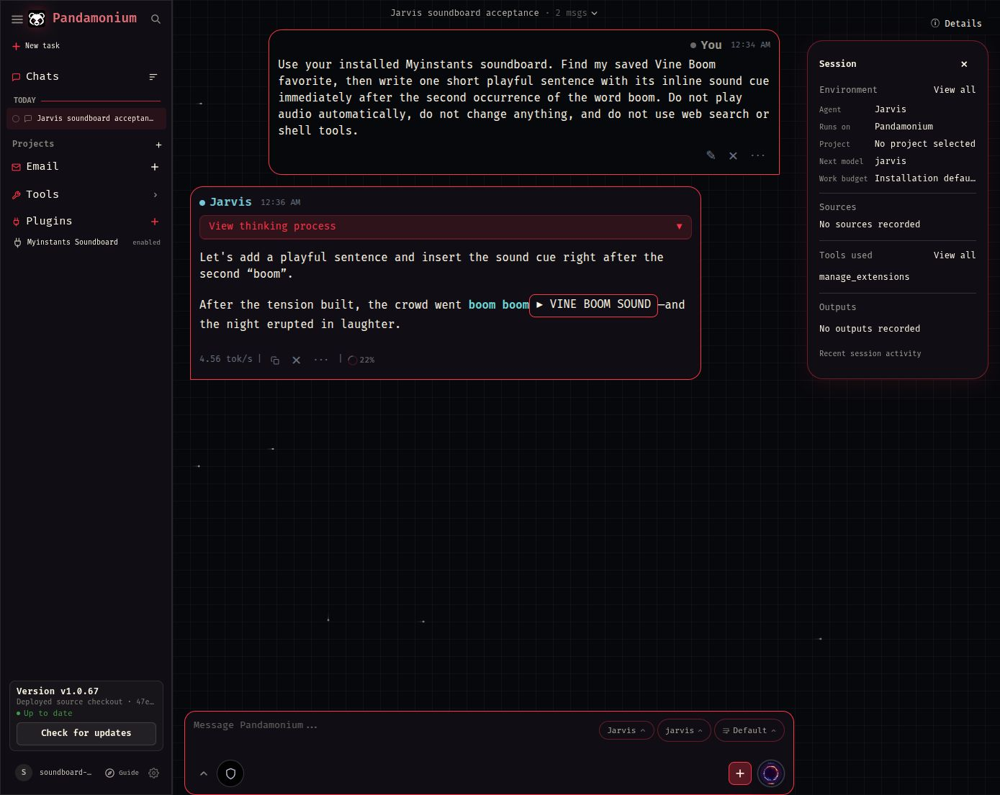

# Myinstants soundboard — MAD-968

Status: tested source preview, not released or deployed. Exact voice-word effects remain incomplete. Base: `main@47e306cec3aa34cd3410812409e975c98a16beaa`; no changes from the paused MAD-964 branch were imported.

The installed Myinstants plugin exposes search, detail, recent sounds and owner favorites. Settings → Soundboard offers search, manual preview, favorites and independent effects volume/mute. Disabled plugins retain favorites; uninstall hides the tab and preserves owner data. Favorites are separate from Myinstants website accounts.

Jarvis can retrieve a favorite and put the returned `[[sound:ID]]` token at a chosen response position. Text displays a titled manual play/pause button, never autoplay. Shared rendering handles streaming and history. Message persistence validates resolved sound identities and records distinct cue IDs, message/session identity and UTF-16 offsets. Code examples do not become cues. Speech cleanup removes cue tokens; voice effects are not scheduled yet.

## Deterministic package and native check

No model calls are used for preparation, installation, search, favorites or playback. The reviewed recipe pins upstream Myinstants `435d40d309ab2790e21567b00c9727509badeedd` and its PHP runtime; TLS remains verified. The native host owns the four fixed read-only bindings. Other executable bindings still require effectful authority.

```sh
.venv/bin/python scripts/prepare_soundboard_package.py --output /tmp/soundboard-package
sh scripts/check_package_runtimes.sh .venv/bin/python tests/deployed/soundboard_native.py /tmp/soundboard-package /tmp/soundboard-proof
```

Use a fresh output directory. The check performs actual installation with normal lifecycle approval, live search/detail/favorites, owner isolation, MP3 retrieval, disable/enable, database cue reload, removal and saved-data preservation in a disposable owner environment. It does not install into your account. Prepared package version 1.1.0 uses the new native soundboard bindings in this branch. This branch still reports application 1.0.67; the release must declare the correct new application compatibility floor before marketplace publication. The disposable check uses source directly, without a marketplace compatibility override.

Tested archive SHA-256: `0551e968c20ba8b9dbdaa425d5b056ee8f27dd6d0901f29337427bb1167e6958` (26,326 bytes). Tree digest: `9d0aced18517b9ac16b1f5d3efd13a102784501e1b2a8707453791cb6ae3abea`.

## Evidence

- Native package check passed against real Myinstants: selected MP3 21,230 bytes, `audio/mpeg`; foreign owner denied; saved cue metadata survived database reload; favorites survived disable/enable and uninstall.
- Actual authenticated disposable app: Settings search/favorite/preview and saved Jarvis response inspected. System loopback captured the manual preview with correlation 0.9999999994 against the selected sound. This proves effect playback, not word synchronization.
- Two bounded self-hosted GPT-OSS conversations, with no paid provider or fallback. The first exposed an existing tool-catalog budget problem: `manage_extensions` was dropped from the 32K context. Prioritizing the discovery gateway fixes that shared cause. The second discovered the installed plugin, mounted favorites, retrieved Vine Boom and placed its token after the second bold `boom` in five rounds. One invalid tool action was rejected before Jarvis corrected it. No ingestion inference was involved.
- 119 focused Python tests passed across soundboard, adapter/intake, persistence, catalog and voice bridges. Final persistence/catalog subset: 43 passed. Two Chromium soundboard checks and both existing Node voice test scripts passed. Browser fixtures mock media playback; the separate loopback above supplies real playback evidence. Selected Ruff, mypy and import-order checks passed.
- Voice tests contained two stale fixtures: a fixed service-worker cache number and a DOM mock missing `classList`. Those fixtures were updated to exercise the current production behavior.

Sanitized measurements: [proof.json](evidence/mad-968/proof.json). Local-only raw proof resides under `/tmp/mad968/`; it is not a durable release artifact.




## Remaining acceptance and rollback

Installed Chatterbox returns WAV without word timestamps; current application events expose PCM/block duration, not word boundaries. Text length or block timing cannot prove the required selected-word occurrence. The governing plan A6 requires discussion before another model or timing mechanism is used. Evaluation of the existing local Whisper as an observer of copied audio is pending Leo's answer; it has not run. No Chatterbox, STT, model-default or speech-scheduling change was made.

Still required: verified word alignment, independent voice overlay/cancellation, real loopback showing no early effect and at most 150 ms late, unchanged speech/microphone behavior, full candidate release checks, signed package/application publication, protected CT103 app-only update with backup/rollback, and Leo's feedback. Keep MAD-968 In Progress. No successor task or next plugin.

Production has not changed. The last read-only baseline was CT103 `1.0.67-c890c857`; recheck before any release. Source rollback is a scoped revert; there is no deployed candidate to roll back.
