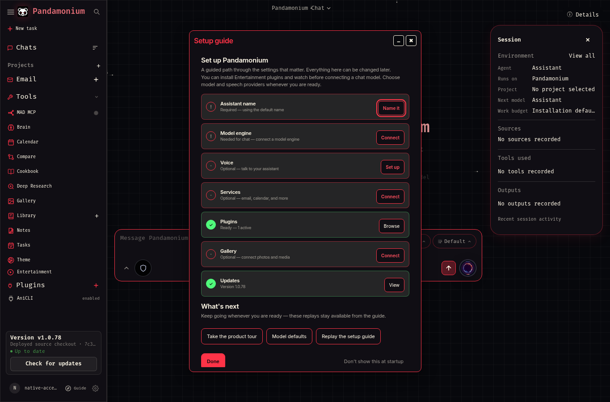
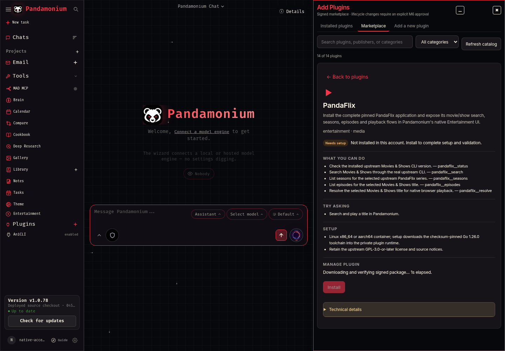
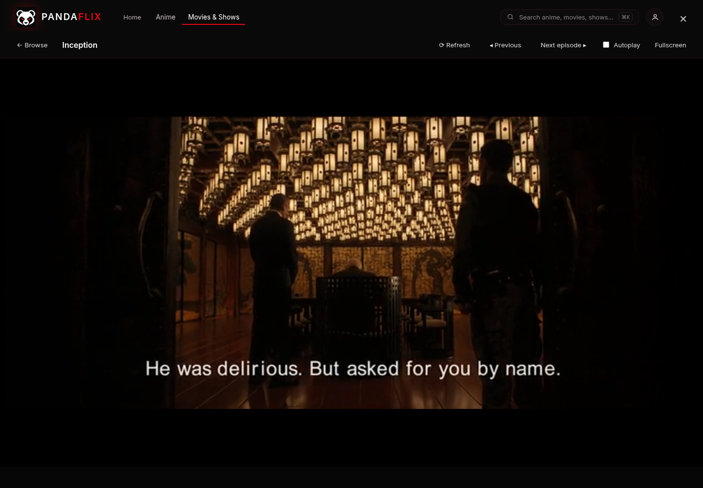

# Native Linux laptop installation

Pandamonium can run as a local desktop application with its existing browser UI,
without Docker or Proxmox. This profile runs one backend worker when launched,
uses a separate Python 3.12.12 environment, and stores the app and user data on
the local disk. It uses installed Chrome or Chromium in an application window,
falling back to the default browser. No desktop theme or global Python setting
is changed.

This is a **host-managed source installation** under development in MAD-1026.
It is not a signed managed release and does not enable the root in-app updater.
The signed release verification and root updater remain unchanged. Install only
an exact reviewed commit; a release containing this installer is still required
before recommending it as the stable public install.

## Install a reviewed revision

The initial validated target is Linux x86_64 with a systemd user session,
8 GiB free disk and at least 2 GiB available RAM. Other distributions and
architectures require their own acceptance proof. On Arch and EndeavourOS,
install `git`, `uv`, and a browser using the distro package manager. Debian
requires installing uv separately from its official distribution. The installer
reports missing tools and streams its dependency output; it never installs a
package into the distro Python.

Install the prerequisites on Arch or EndeavourOS if they are missing:

```bash
sudo pacman -S --needed git uv python xdg-utils
```

Use your installed browser. Chrome or Chromium opens an app window; other
browsers use a normal tab. Keep the installer checkout on the local SSD. This
[partial clone](https://git-scm.com/docs/git-clone) defers historical file
contents; checking out the pinned revision downloads its required files.
The validated source revision below is available in [PR312](https://github.com/MADPANDA3D/Pandamonium/pull/312):

```bash
mkdir -p ~/.local/state/pandamonium-install
git clone --filter=blob:none --no-checkout https://github.com/MADPANDA3D/Pandamonium.git ~/.local/state/pandamonium-install/source
cd ~/.local/state/pandamonium-install/source
git checkout --detach 580c90c3802c7dbab88fae770e8bdd99df3b54cb
```

Inspect `scripts/install-native-linux.py`, then run this single installation
command from that checkout:

```bash
python3 scripts/install-native-linux.py --revision HEAD --provision-runtime
```

If you already have the checkout, reuse it; `git clone` refuses a nonempty
destination. Review future revisions explicitly before updating the pin.

The command refuses tracked edits and exports only committed files, excluding
`.env`, local data and Git metadata. Python dependencies come from the committed
hash-locked laptop profile; native package compilation fails clearly if a
compatible wheel is unavailable. Existing install paths are checked before
replacement. A failed upgrade preserves failed data for inspection and restores
the previous snapshot and stopped-state data backup.
The profile pins accounts, plugin state and SQLite to its own `data/` directory.
An existing configuration pointing those files elsewhere is refused, so the
backup cannot silently omit a separate database. Backup failure before switching
versions restarts the previous service without changing its data.
If restoring a failed upgrade cannot finish, the backend stays stopped and
`recovery.json` records the exact backup and snapshots. Reinstalling is blocked
until that recovery is inspected; partial restored data is never started.

`--provision-runtime` explicitly authorizes the existing first-party sandbox
provisioner. It asks for sudo in the terminal when necessary; no password is
stored in application settings. Executable plugins need bubblewrap, util-linux,
an actual systemd user manager with kernel resource controls, and a dedicated
4 GiB ext4 runtime filesystem. It never formats an existing runtime image.
Repeated runs validate and remount that image. An occupied target, symlink,
wrong filesystem or conflicting persistent mount fails closed.

Use `--check` to inspect prerequisites, or omit `--provision-runtime` when you
only want the base app. Executable plugins then remain **Needs setup** until
their existing enforced prerequisites pass.

## First launch and user choices

Launch **Pandamonium** from the application menu, or run:

```bash
~/.local/bin/pandamonium-desktop
```

The launcher starts `pandamonium-desktop.service` in the logged-in user session
and waits for localhost health before opening the browser. The service is not
enabled at login and does not enable linger. It listens at
`http://127.0.0.1:7000`; an unrelated process already using that port is refused.
Create your account on the first-run page. The installer does not create an
account, choose an identity or copy provider credentials from another machine.

Use **Add Plugins → Marketplace** to select and approve AniCLI and PandaFlix.
Their signed packages run in private bounded runtimes. No chat model is needed
to install or use these Entertainment providers. Builds use their pinned
upstream toolchains; installation readiness is distinct from provider network
availability. Existing desktop mpv is not required for web playback.

The setup guide lets you leave chat and voice unconfigured while using a signed
Entertainment plugin. This example uses a disposable test account:



Package verification and private runtime preparation show elapsed progress.
Keep the preview open and approve the displayed operation once it is ready:



Configure and test optional API model and speech providers in Settings.
Browser speech depends on the browser's actual voices, recognition support and
microphone permissions; recognition is not guaranteed offline. The installer
does not install Whisper, Kokoro, Ollama or model weights.

Local embeddings are explicitly disabled in `~/.config/pandamonium/native.env`.
This prevents automatic FastEmbed model downloads, including direct consumers.
Without a separately configured Chroma service and embedding provider, semantic
memory and document vector search are reduced; existing keyword functionality
and Entertainment remain available. Optional semantic services must be chosen
and configured separately.

## Files and resource use

| Path | Purpose |
| --- | --- |
| `~/.local/share/pandamonium/versions/` | Exact app snapshots and isolated environments |
| `~/.local/share/pandamonium/current` | Active snapshot pointer |
| `~/.local/share/pandamonium/data/` | Private accounts, chats, preferences and plugins |
| `~/.local/share/pandamonium/backups/` | Stopped-state snapshots retained for recovery |
| `~/.local/share/pandamonium/browser/` | Dedicated Chrome or Chromium app profile |
| `~/.config/pandamonium/native.env` | Private deployment settings, preserved on reinstall |
| `/var/lib/pandamonium-package-runtime.img` | Bounded executable-plugin filesystem |

Keep these files on the local SSD; the USB project checkout can remain source
history. Backend memory is capped at 3 GiB, CPU at two cores. Plugin workloads
retain their aggregate 4 GiB/two-core and per-process 2 GiB limits. These are
separate budgets, not a guarantee of total laptop RAM use; browser video buffers
also consume memory. Long forward buffering remains the existing operator
preference and should be assessed during real playback.

## Restart, logs and recovery

```bash
systemctl --user restart pandamonium-desktop.service
journalctl --user -u pandamonium-desktop.service -f
systemctl --user stop pandamonium-desktop.service
```

Re-running the installer reuses an exact completed app/environment snapshot and
preserves the account, data and settings. Interrupted candidate directories are
retained for diagnosis; they are never treated as completed. Upgrades require a
reviewed new commit and this same installer. Prior snapshots and backups remain
available; do not prune them until the new version has passed acceptance.

For a manual rollback, stop the service, inspect `installation.json` for the
recorded `previous` snapshot and `backup`, preserve current data, restore that
specific backup if required by the version transition, point `current` at the
previous snapshot, and start the service. Never blindly replace a live database.

For removal, stop the user service and remove its unit, desktop menu entry and
`~/.local/bin/pandamonium-desktop`, then run `systemctl --user daemon-reload`.
Keep the app's data, browser profile and backups unless you explicitly want to
delete them. Runtime mount removal is a separate administrator action: other
Pandamonium installs may still use it. No uninstall step should remove a shared
Python runtime, distro package or unrelated user configuration.

## Validated desktop behavior and remaining limits

On the initial EndeavourOS laptop, installation, repeat provisioning, upgrade,
service restart and SQLite integrity passed. Scoped app and runtime sentinels
survived a repeat install; the existing ext4 filesystem kept its UUID. Backend
startup used about 300–340 MiB. Isolated real playback measured Chrome PSS of
about 586–685 MiB and backend PSS of about 216–480 MiB. These are snapshots of
the tests, not a maximum for longer viewing sessions.

Signed AniCLI 5.1.2 and PandaFlix 1.2.1 installed without a chat model. Actual
desktop tests covered search, episodes/seasons, HLS decoding, quality selection,
seeking, next episode and reopening saved history at the recorded position.
PandaFlix also advanced automatically at a resumed episode's natural end, with
the inactive player paused. Failed operations record a local failure code in
the journal without logging provider response text or stream URLs.
PandaFlix HLS captions loaded and displayed English cues:



The older signed AniCLI package still labels some movie search results
**View episodes**; selecting the movie plays it without exposing fake episode
controls. The corrected typed adapter requires separate signed catalog
publication. PandaFlix's existing adapter also retains an approximately
10-second resolve wait. Sandbox-local subtitle files are omitted; embedded HLS
captions can work, as shown above.

The automated test using installed Chrome exposed speech recognition and
synthesis APIs, but reported zero available synthesis voices. Microphone access
without permission returned
`NotAllowedError`. Choose a working browser voice or configure and test your
own remote STT/TTS provider; no offline recognition or API-provider success is
implied by these capability checks.

This profile is validated for the desktop browser. At a 412-pixel mobile
viewport, some existing Entertainment controls overflow and library navigation
is hidden. [The mobile capture](images/native-linux-mobile-limit.png) records
that limitation; it is not a supported mobile acceptance result.

Reboot, uninstall on a disposable installation, a second Linux distribution and
signed public release publication remain separate acceptance requirements.
